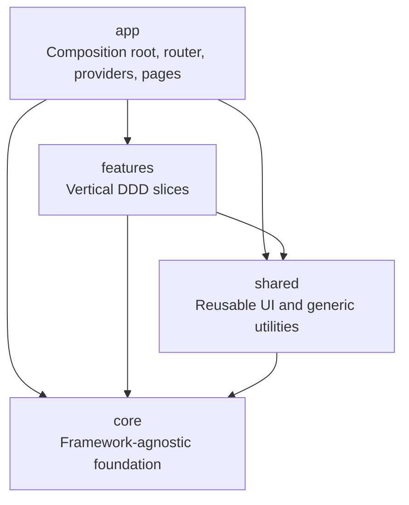
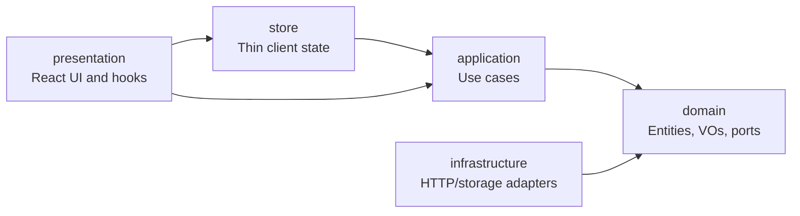

# React-CleanWithDDD-Template

A production-grade React + TypeScript starter template built with **Clean Architecture**, **Domain-Driven Design (DDD)**, strict TypeScript, enforced dependency boundaries, runtime validation, resilient API access, typed errors, and a practical feature generator.

This repository is not just a UI starter. It is a complete frontend engineering template for teams that want React apps to stay maintainable after the first few screens become dozens of features, API integrations, forms, permissions, and production bugs.

> If you are building a serious React application, start here instead of starting from an empty Vite project. This template gives you the architecture, conventions, guardrails, examples, and tests that most teams only add after painful refactors.

---

## Table of contents

- [Why this template exists](#why-this-template-exists)
- [Who should use it](#who-should-use-it)
- [What you get](#what-you-get)
- [Core benefits](#core-benefits)
- [Tech stack](#tech-stack)
- [Quick start](#quick-start)
- [Scripts](#scripts)
- [Architecture overview](#architecture-overview)
- [Full folder structure](#full-folder-structure)
- [Layer-by-layer explanation](#layer-by-layer-explanation)
- [Feature anatomy](#feature-anatomy)
- [Dependency rules](#dependency-rules)
- [Golden engineering rules](#golden-engineering-rules)
- [How data flows through the app](#how-data-flows-through-the-app)
- [API and infrastructure rules](#api-and-infrastructure-rules)
- [State management rules](#state-management-rules)
- [Forms and validation rules](#forms-and-validation-rules)
- [Error handling rules](#error-handling-rules)
- [Testing strategy](#testing-strategy)
- [Adding a new feature](#adding-a-new-feature)
- [Definition of done](#definition-of-done)
- [Why every team should use this](#why-every-team-should-use-this)
- [Documentation map](#documentation-map)

---

## Why this template exists

Most React projects begin simple:

```text
components/
pages/
services/
hooks/
utils/
```

That works for a few weeks. Then the project grows:

- Components start calling APIs directly.
- API response shapes leak into the UI.
- Validation rules are duplicated between forms, API mappers, and stores.
- Business rules hide inside button click handlers.
- Zustand/Redux stores become giant service layers.
- Tests require too much mocking because everything knows about everything.
- Refactoring is scary because imports are tangled.
- New developers do not know where files should go.
- The app technically works, but every change gets slower.

This template prevents that from day one.

It provides a strict, documented, and lint-enforced architecture where:

- Business rules live in the **domain**.
- Workflows live in **application use cases**.
- APIs, storage, DTOs, and browser details live in **infrastructure**.
- React components stay in **presentation**.
- App wiring happens in one **composition root**.
- Shared UI and utilities are reusable without feature coupling.
- Expected failures are explicit values through `Result<T, AppError>`.
- Every external payload is validated before it reaches the domain.
- The compiler and linter stop architectural drift before it enters the codebase.

The goal is simple: **make the correct way the easiest way.**

---

## Who should use it

Use this template if you are building:

- Business dashboards
- SaaS frontends
- Admin panels
- Internal tools
- CRM/ERP-style apps
- Multi-feature enterprise React apps
- Apps with authentication and protected routes
- Apps that call real APIs and need reliable error handling
- Apps with teams of multiple frontend developers
- Apps that should survive long-term maintenance

It is especially useful for teams coming from .NET/C#/Java/NestJS-style layered architecture who want the same discipline in a React frontend.

You may not need this if you are building a one-page landing page, a throwaway prototype, or a static marketing site. For serious product UI, this structure pays for itself quickly.

---

## What you get

This template includes:

- **React 18 + Vite 8 + TypeScript** configured for strict production work.
- **Clean Architecture**: dependencies always point inward.
- **DDD feature structure**: domain, application, infrastructure, presentation, store.
- **Strict TypeScript settings** such as `exactOptionalPropertyTypes`, `noUncheckedIndexedAccess`, `noImplicitOverride`, and `verbatimModuleSyntax`.
- **ESLint architecture enforcement** using restricted paths and per-layer import bans.
- **Result-based error handling** for expected failures.
- **Typed app error hierarchy** with stable error codes.
- **Zod runtime validation** for environment variables, API responses, and storage payloads.
- **HttpClient abstraction** with auth, refresh, retry, timeout, and typed transport errors.
- **TanStack Query** for server state.
- **Zustand** for thin client/UI state.
- **react-hook-form** with domain-driven validation.
- **Radix UI + Motion** for accessible UI primitives and transitions.
- **CSS Modules + design tokens** for styling.
- **Vitest + Testing Library** for unit and integration tests.
- **Playwright** for e2e tests.
- **Feature generator**: `npm run new:feature` creates a full DDD feature slice.
- **Reference features**: `auth` and `tasks` show real patterns.
- **Developer guide** and architecture contract included in the repo.

---

## Core benefits

### 1. Business logic is protected from UI churn

React components are allowed to change. Design systems change. API clients change. State libraries change.

Your business rules should not change just because the UI does.

In this template, business rules live in pure TypeScript domain objects. They do not import React, Zustand, HTTP clients, browser APIs, routes, or DTOs. That makes them easy to test, easy to reason about, and hard to accidentally break.

### 2. Every feature has the same shape

A developer opening any feature knows where to look:

- Rules: `domain/`
- User actions: `application/use-cases/`
- API implementation: `infrastructure/`
- UI: `presentation/`
- Client state: `store/`
- Wiring: `<feature>-module.ts`
- Public exports: `index.ts`

This removes guesswork. It also makes code review much easier because reviewers can quickly spot misplaced logic.

### 3. Dependency boundaries are enforced, not just documented

Many projects say they follow architecture. This template makes the linter enforce it.

If domain imports React, lint fails. If a feature reaches into app wiring, lint fails. If a component tries to import infrastructure directly, lint fails.

Architecture becomes a build-time rule instead of a team meeting reminder.

### 4. API changes are isolated

API JSON belongs in infrastructure, not in the UI.

Every external response is validated with Zod and mapped to domain objects. If the backend changes a field name, you fix the mapper or DTO schema. You do not hunt through components for `response.data.something`.

### 5. Tests become smaller and faster

Because use cases depend on ports/interfaces, tests can use typed fakes instead of real APIs. Domain tests do not need React. Infrastructure tests can focus on mapping and validation. Component tests focus on user behavior.

You test the right thing at the right layer.

### 6. Server state and client state do not get mixed

Server data belongs to TanStack Query. UI/client state belongs to Zustand or local state.

This prevents the common mistake of copying API data into a global store and reimplementing cache invalidation, stale data, loading flags, and refetching badly.

### 7. Onboarding is faster

The README, `ARCHITECTURE.md`, `CONTRIBUTING.md`, and `docs/DEVELOPER_GUIDE.md` explain the rules and the practical workflow.

New developers do not need to invent patterns. They follow the template, use the generator, and copy from the reference features.

### 8. Refactoring is safer

Strict imports, strict types, explicit errors, and isolated feature modules make it much easier to move or change code without breaking unrelated areas.

---

## Tech stack

- **React 18** — UI rendering.
- **Vite 8** — fast dev server and production build.
- **TypeScript** — strict static typing.
- **Zustand** — thin client/UI state stores.
- **TanStack Query** — server state, caching, refetching, mutations.
- **Zod** — runtime validation for env, API DTOs, and storage.
- **react-hook-form** — performant form state.
- **Radix UI** — accessible primitives such as modal, dropdown, tabs, tooltip.
- **Motion** — animation and transitions with reduced-motion support.
- **Vitest** — unit and integration tests.
- **Testing Library** — user-centered React tests.
- **Playwright** — end-to-end browser tests.
- **ESLint flat config** — strict linting and architecture enforcement.
- **Prettier** — formatting.
- **Husky + lint-staged** — pre-commit quality checks.

---

## Quick start

```bash
git clone https://github.com/GUCAP-LIMITED/React-CleanWithDDD-Template.git
cd React-CleanWithDDD-Template
npm install
cp .env.example .env.local
npm run dev
```

The dev server runs at:

```text
http://localhost:5173
```

Before pushing any change, run:

```bash
npm run validate
npm run build
```

---

## Scripts

| Script                                   | Purpose                                                        |
| ---------------------------------------- | -------------------------------------------------------------- |
| `npm run dev`                            | Start the Vite dev server.                                     |
| `npm run build`                          | Type-check and build the app for production.                   |
| `npm run preview`                        | Preview the production build locally.                          |
| `npm run typecheck`                      | Run TypeScript project checks only.                            |
| `npm run lint`                           | Run ESLint and enforce architecture boundaries.                |
| `npm run lint:fix`                       | Auto-fix lint issues where safe.                               |
| `npm run format`                         | Format the repository with Prettier.                           |
| `npm run format:check`                   | Check formatting without writing changes.                      |
| `npm run test`                           | Run Vitest once.                                               |
| `npm run test:watch`                     | Run Vitest in watch mode.                                      |
| `npm run test:coverage`                  | Run tests with coverage thresholds.                            |
| `npm run e2e`                            | Run Playwright e2e tests.                                      |
| `npm run e2e:ui`                         | Run Playwright in interactive UI mode.                         |
| `npm run validate`                       | Run typecheck, lint, and tests. This is the main quality gate. |
| `npm run new:feature -- <name> [Entity]` | Generate a full DDD feature slice.                             |

---

## Architecture overview

The app is organized into four top-level layers:

```text
app
  │ depends on
  ▼
features
  │ depends on
  ▼
shared
  │ depends on
  ▼
core
```

### Dependency direction

Dependencies always point inward/downward:

- `app` can use `features`, `shared`, and `core`.
- `features` can use `shared` and `core`.
- `shared` can use `core`.
- `core` uses nothing above it.

The lower a layer is, the more stable and framework-independent it should be.



### Why this matters

If dependencies point in every direction, every change becomes risky. A component change can break a domain rule. A DTO change can ripple into five pages. A store can silently become a business service.

This architecture keeps high-level rules independent from low-level details.

---

## Full folder structure

The current template has this structure:

```text
.
├── .cursor/
│   └── rules/
│       └── architecture.mdc          # Cursor/AI coding rules matching this architecture
├── .github/
│   └── workflows/                    # CI workflows
├── .husky/                           # Git hooks
├── docs/
│   └── DEVELOPER_GUIDE.md            # Practical feature-building handbook
├── e2e/                              # Playwright end-to-end tests
├── scripts/
│   └── generate-feature.mjs          # Feature slice generator
├── src/
│   ├── app/
│   │   ├── di/
│   │   │   └── composition-root.ts    # The only app-wide composition root
│   │   ├── pages/                    # App-level pages such as Dashboard/404/Forbidden
│   │   ├── router/
│   │   │   └── AppRouter.tsx         # Route declarations and lazy page imports
│   │   ├── styles/
│   │   │   └── global.css            # Global styles and design tokens
│   │   ├── App.tsx                   # App shell and providers
│   │   └── AppErrorBoundary.tsx      # Top-level error boundary
│   ├── core/
│   │   ├── config/                   # Typed, Zod-validated app configuration
│   │   ├── domain/                   # Shared domain kernel used by multiple features
│   │   ├── errors/                   # AppError and DomainError hierarchy
│   │   ├── http/                     # HttpClient port + fetch/retry/timeout/auth decorators
│   │   ├── logger/                   # Logger port and console implementation
│   │   ├── result/                   # Result<T, E>, ok, err, isOk, isErr
│   │   └── time/                     # Clock port for deterministic time
│   ├── features/
│   │   ├── auth/                     # Reference auth feature with store-backed client state
│   │   │   ├── application/          # Login, logout, refresh, restore use cases
│   │   │   ├── domain/               # Auth entities, value objects, errors, ports
│   │   │   ├── infrastructure/       # Auth API gateway, DTOs, mappers, local session store
│   │   │   ├── presentation/         # Login page, protected route, auth hooks/providers
│   │   │   ├── store/                # Thin Zustand auth/session store
│   │   │   ├── auth-module.ts        # Auth feature composition root
│   │   │   └── index.ts              # Public API for the auth feature
│   │   └── tasks/                    # Reference CRUD feature using TanStack Query
│   │       ├── application/          # List/create/toggle/delete use cases
│   │       ├── domain/               # Task entity, TaskTitle VO, errors, gateway port
│   │       ├── infrastructure/       # Task HTTP gateway, DTOs, mapper
│   │       ├── presentation/         # Page, hooks, form, row, modal, provider
│   │       ├── tasks-module.ts       # Tasks feature composition root
│   │       └── index.ts              # Public API for the tasks feature
│   ├── shared/
│   │   ├── forms/                    # domainResolver for react-hook-form
│   │   ├── ui/                       # Reusable UI primitives
│   │   │   ├── Alert/
│   │   │   ├── Button/
│   │   │   ├── DropdownMenu/
│   │   │   ├── IconButton/
│   │   │   ├── Modal/
│   │   │   ├── Spinner/
│   │   │   ├── Tabs/
│   │   │   ├── TextField/
│   │   │   ├── Tooltip/
│   │   │   └── motion/
│   │   └── utils/                    # Generic utilities
│   ├── testing/
│   │   ├── builders/                 # Test data builders
│   │   ├── fakes/                    # Typed fake ports for tests
│   │   └── index.ts
│   ├── main.tsx                      # React entrypoint
│   └── vite-env.d.ts
├── ARCHITECTURE.md                   # Architecture contract
├── CONTRIBUTING.md                   # Concrete team rules
├── package.json
├── eslint.config.ts                  # Lint + architecture enforcement
├── tsconfig*.json                    # Strict TypeScript configs
├── vite.config.ts
├── vitest.setup.ts
└── playwright.config.ts
```

---

## Layer-by-layer explanation

### `core/` — stable foundation

`core` is the lowest-level application foundation. It must be framework-agnostic and reusable across features.

It contains:

- `core/config` — Zod-validated configuration. Only this module reads `import.meta.env`.
- `core/result` — explicit success/failure values: `Result<T, E>`, `ok`, `err`, `isOk`, `isErr`.
- `core/errors` — base error hierarchy: `AppError`, `DomainError`, typed error codes.
- `core/http` — `HttpClient` port and resilient HTTP decorators.
- `core/domain` — shared value objects used by multiple features, such as `Email`.
- `core/time` — `Clock` port so domain/application logic does not call time directly.
- `core/logger` — `Logger` port; direct `console` usage is blocked elsewhere.

Rules:

- `core` must not import `app`, `features`, or `shared`.
- `core/domain` must not import `core/http`.
- Keep `core` small and stable.
- Move something into `core` only when it is truly cross-cutting or shared by multiple features.

### `shared/` — reusable building blocks

`shared` contains generic reusable UI, forms, and utilities.

It knows nothing about business features. A button, modal, text field, generic formatter, or form resolver belongs here. A `TaskCard` does not belong here because it knows about the tasks feature.

Rules:

- `shared` may depend on `core`.
- `shared` must not depend on `features` or `app`.
- Shared UI components should be accessible, reusable, and styled with CSS Modules.
- Feature-specific UI stays inside the feature's `presentation/` folder.

### `features/` — vertical business slices

Each feature is a self-contained vertical slice. It owns its domain model, use cases, infrastructure adapters, UI, and feature-level wiring.

Current reference features:

- `auth` — login, logout, refresh, restore session, protected routes, local session store, thin Zustand store.
- `tasks` — list, create, toggle, delete tasks through TanStack Query and DDD layers.

Rules:

- A feature may use `core` and `shared`.
- A feature must not import from `app`.
- A feature must not import another feature's internals.
- Other code should import a feature only through its public `index.ts`, except lazy-loaded page components.

### `app/` — composition and shell

`app` is the outermost layer. It wires everything together.

It owns:

- Dependency injection and singleton construction.
- Router setup.
- App-level providers.
- App shell.
- Global styles.
- Error boundary.
- Top-level pages.

Rules:

- App can import from any layer.
- App is the only place that should construct concrete cross-cutting implementations.
- App should not contain business rules.

---

## Feature anatomy

Every feature follows this structure:

```text
src/features/<feature>/
├── domain/
│   ├── entities/              # Entities and aggregates
│   ├── value-objects/         # Validated values such as Title, Email, Money
│   ├── errors/                # Feature-specific domain errors
│   ├── ports/                 # Interfaces required by the domain/application
│   └── index.ts               # Domain barrel
├── application/
│   ├── use-cases/             # One class per user action/workflow
│   └── index.ts
├── infrastructure/
│   ├── dto/                   # Zod schemas and DTO types for external data
│   ├── <feature>-mapper.ts    # DTO to domain mapping
│   ├── <feature>-http-gateway.ts
│   └── index.ts
├── presentation/
│   ├── <Feature>Page.tsx
│   ├── use-<feature>.ts       # Query/mutation hooks or UI hooks
│   ├── <Feature>ModuleProvider.tsx
│   ├── use-<feature>-module.ts
│   └── index.ts
├── store/                     # Optional; only for client/UI state
├── <feature>-module.ts        # Feature composition root
└── index.ts                   # Public feature API
```

### Domain layer

The domain layer answers: **what is true in the business?**

It contains:

- Entities
- Aggregates
- Value objects
- Domain errors
- Ports/interfaces
- Pure business rules

It must not contain:

- React
- Zustand
- HTTP
- DTOs
- Browser storage
- Routing
- UI state
- API response shapes

Example responsibility:

```text
A task title cannot be empty and cannot be longer than the allowed length.
```

That rule belongs in `TaskTitle.create`, not in a component, store, or API mapper.

### Application layer

The application layer answers: **what does the user want to do?**

It contains use cases such as:

- `LoginUseCase`
- `RestoreSessionUseCase`
- `CreateTaskUseCase`
- `ToggleTaskUseCase`
- `DeleteTaskUseCase`

Use cases orchestrate domain objects and ports. They do not know about React or HTTP.

A use case should:

- Validate input through domain value objects.
- Call domain ports.
- Return `Result<T, AppError>` for expected failures.
- Log through injected `Logger` where needed.
- Stay small and focused.

### Infrastructure layer

The infrastructure layer answers: **how do we talk to the outside world?**

It contains:

- HTTP gateways
- Browser storage adapters
- DTO schemas
- Mappers
- API endpoint constants
- Error translation from transport errors to domain errors

Infrastructure implements domain ports. It is where JSON, HTTP, localStorage, and other external details are allowed.

### Presentation layer

The presentation layer answers: **how does the user interact with this feature?**

It contains:

- React pages
- Components
- Hooks
- Route guards
- Module providers
- Query/mutation hooks
- CSS Modules

Presentation should render state and dispatch actions. It should not contain business rules or direct API calls.

### Store layer

`store/` is optional. Use it only for client/UI state.

Good store use cases:

- Auth session state
- Drawer open/closed state
- Wizard step state
- UI filters that are not server-owned

Bad store use cases:

- Copying fetched API lists into global state
- Reimplementing query caching
- Putting business rules in actions
- Calling HTTP directly

---

## Dependency rules

### Top-level dependency rule

```text
app → features → shared → core
```

Forbidden examples:

```ts
// ❌ core cannot know about a feature
import { Task } from '@features/tasks';

// ❌ shared cannot know about a feature
import { useAuth } from '@features/auth';

// ❌ feature cannot depend on app wiring
import { composition } from '@app/di/composition-root';
```

Allowed examples:

```ts
// ✅ feature uses core foundation
import { type Result, ok, err } from '@core/result';

// ✅ feature presentation uses shared UI
import { Button } from '@shared/ui';

// ✅ app wires features together
import { createAuthModule } from '@features/auth';
```

### Inside-feature dependency rule

```text
presentation → store → application → domain ← infrastructure
```

Meaning:

- `domain` imports only domain/core primitives.
- `application` imports domain abstractions.
- `infrastructure` implements domain ports.
- `presentation` talks to hooks/store/use cases, never directly to infrastructure.
- `store` delegates to use cases and contains no business rules.



---

## Golden engineering rules

These are the rules every contributor must follow.

### 1. Business rules live in the domain

If an `if` statement expresses business meaning, it probably belongs in a domain entity, value object, or domain service.

Bad:

```tsx
if (title.trim().length === 0) {
  setError('Title is required');
}
```

Good:

```ts
const title = TaskTitle.create(rawTitle);
if (isErr(title)) return err(title.error);
```

### 2. Components render; they do not decide business policy

React components should:

- Read state.
- Render UI.
- Call hooks/actions.
- Show loading/error/empty states.

They should not:

- Validate business rules directly.
- Know API response formats.
- Call `fetch`.
- Construct domain services.

### 3. Use cases orchestrate only

A use case should not become a god object. It coordinates work:

1. Parse or validate input through value objects.
2. Call ports.
3. Return a `Result`.
4. Log meaningful events if needed.

### 4. Infrastructure owns external details

Only infrastructure should know:

- Endpoint paths
- Query parameters
- API DTO field names
- Zod response schemas
- localStorage keys
- HTTP status mapping

### 5. Validate all external data at the boundary

Any data from outside the app is untrusted:

- Environment variables
- API responses
- localStorage/sessionStorage
- URL params if they become domain input

Use Zod before that data reaches the domain.

### 6. Use `Result` for expected failures

Expected failures are values, not exceptions.

Examples:

- Invalid input
- Authentication failed
- Resource unavailable
- Validation failed
- API returned expected error state

Use:

```ts
Result<T, AppError>;
```

This forces callers to handle both success and failure.

### 7. Never call `fetch` or `axios` directly from features

All network access goes through:

```text
Component → hook → use case → gateway → HttpClient
```

The `HttpClient` pipeline already handles auth, refresh, retry, timeout, and typed transport errors.

### 8. Do not put server state in Zustand

Server state belongs to TanStack Query.

Zustand is for client/UI state only.

### 9. Import through public APIs

Use a feature's `index.ts` as the public surface.

Bad:

```ts
import { TaskHttpGateway } from '@features/tasks/infrastructure/task-http-gateway';
```

Good:

```ts
import { createTasksModule } from '@features/tasks';
```

Exception: routed pages are lazy-loaded from their file path to preserve code-splitting.

### 10. No magic strings

Endpoints, storage keys, query keys, roles, permissions, and grant names should be constants.

### 11. Time, logging, and HTTP are ports

Do not use these directly in business logic:

- `new Date()` / `Date.now()`
- `console.log`
- `fetch`

Use injected ports:

- `Clock`
- `Logger`
- `HttpClient`

### 12. Keep files and functions small

ESLint enforces:

- Function max length: 80 lines
- File max length: 300 lines
- Complexity max: 12
- Params max: 4
- Max nesting depth: 4

If code hits the limit, split it. The limit is a design smell detector.

---

## How data flows through the app

### Auth example

```text
LoginPage
  → useAuth()
  → authStore.login(email, password)
  → LoginUseCase.execute(email, password)
  → Email.create / Password.create
  → AuthGateway.authenticate(email, password)
  → AuthHttpGateway
  → HttpClient
  → Zod DTO validation
  → Mapper to AuthSession domain entity
  → SessionStore.save(session)
  → Result<AuthSession, AuthError>
```

### Tasks example

```text
TasksPage
  → useTasks()
  → TanStack Query useQuery
  → ListTasksUseCase.execute()
  → TaskGateway.list()
  → TaskHttpGateway
  → HttpClient.get('/tasks')
  → Zod validates TaskListDto
  → taskMapper maps DTO to Task domain entity
  → Result<readonly Task[], TaskError>
  → Query exposes loading/error/data to UI
```

### Why this flow is useful

Each step has one responsibility:

- UI handles interaction.
- Query handles request lifecycle and caching.
- Use case handles workflow.
- Gateway handles external communication.
- Zod handles runtime safety.
- Mapper protects the domain from API shape.
- Domain entity/value object protects business invariants.
- Result makes failure explicit.

---

## API and infrastructure rules

### The only allowed API path

```text
presentation hook
  → application use case
  → domain port
  → infrastructure gateway
  → core HttpClient
```

Do not bypass this path.

### HttpClient features

The injected `HttpClient` already includes:

- Bearer token attachment.
- Silent refresh on expired tokens.
- De-duplication of concurrent refresh calls.
- 15-second timeout.
- Retry for transient idempotent GET failures.
- Respect for `Retry-After`.
- Typed `HttpError` and `NetworkError`.

Do not reimplement retry, timeout, or refresh logic inside hooks or gateways.

### DTO and mapper rules

Every API response should have:

1. A Zod schema in `infrastructure/dto/`.
2. An inferred DTO type.
3. A mapper from DTO to domain.
4. Gateway error mapping to domain errors.

Example shape:

```text
raw JSON → Zod schema → DTO → mapper → domain entity/value object
```

This protects the app when the backend changes.

---

## State management rules

### Server state: TanStack Query

Use TanStack Query for anything owned by the API:

- Lists
- Details
- Search results
- Server-side filters
- CRUD responses
- Cached entities

Query owns:

- Loading state
- Error state
- Cache state
- Refetching
- Staleness
- Mutation lifecycle
- Invalidation

### Client/UI state: Zustand or local state

Use Zustand or local React state for things owned by the browser UI:

- Auth session
- Theme
- Modal open/closed
- Wizard current step
- Temporary UI-only filters
- Form UI state not handled by react-hook-form

### Rule of thumb

Ask this question:

> If I refresh from the API, is this value replaced by server truth?

If yes, use TanStack Query. If no, use Zustand/local state.

---

## Forms and validation rules

Forms use:

- `react-hook-form` for form state.
- `domainResolver` from `@shared/forms` for domain validation.
- Domain value objects as the single source of validation truth.

Do not create separate Zod schemas for forms when the validation is a business/domain rule.

Why?

If a title rule lives in both `TaskTitle.create` and a Zod form schema, they will eventually drift. The form should ask the domain, not duplicate the domain.

Correct flow:

```text
TextField input
  → react-hook-form
  → domainResolver
  → TaskTitle.create
  → inline form error
  → submit
  → CreateTaskUseCase validates again authoritatively
```

The form validation is for UX. The use case validation is the authority.

---

## Error handling rules

### AppError hierarchy

All meaningful app errors should extend the shared error hierarchy:

```text
AppError
└── DomainError
    └── FeatureError
        ├── InvalidSomethingError
        └── SomethingUnavailableError
```

Every concrete error should have:

- A stable `code`.
- A useful message.
- Optional context/cause.

### Expected vs unexpected failures

Expected failures return `Result`:

```ts
return err(new InvalidTaskTitleError(rawTitle));
```

Unexpected failures can throw, but should be rare and usually caught at boundaries.

### Gateway error mapping

Gateways catch transport errors and map them to domain errors:

```text
HttpError / NetworkError / invalid DTO
  → log with context
  → return err(new TasksUnavailableError(cause))
```

Presentation should show user-safe messages, never raw stack traces.

---

## Testing strategy

Testing follows the architecture.

### Domain tests

Test entities and value objects directly. No React. No mocks. No HTTP.

Examples:

- `TaskTitle.create` accepts valid input.
- `TaskTitle.create` rejects empty input.
- `Task.withCompleted` returns a new immutable entity.

### Application tests

Test use cases with typed fakes.

Examples:

- `CreateTaskUseCase` validates title before calling gateway.
- `LoginUseCase` maps invalid credentials correctly.
- `RestoreSessionUseCase` handles missing sessions.

### Infrastructure tests

Test DTO mapping and external shape handling.

Examples:

- API DTO maps correctly to domain entity.
- Invalid API response becomes a domain error.

### Presentation tests

Test important user flows through UI.

Examples:

- Login page shows error when authentication fails.
- Form validation displays domain error messages.
- Task list shows loading/error/empty states.

### Test utilities

Shared test helpers live in:

```text
src/testing/
├── builders/     # Test data builders
└── fakes/        # Fake implementations of ports
```

Use fakes instead of real APIs in tests.

---

## Adding a new feature

Use the generator:

```bash
npm run new:feature -- invoices Invoice
```

or:

```bash
npm run new:feature -- notes
```

The generator creates:

- Domain entity
- Value object
- Domain errors
- Gateway port
- Application use cases
- Infrastructure DTOs
- Mapper
- HTTP gateway
- Presentation hooks
- Form using `domainResolver`
- Module provider
- Feature composition root
- Public barrel
- Tests
- Testing fakes/builders

After generating, wire it into the app:

1. Add the feature module to `src/app/di/composition-root.ts`.
2. Add the feature provider in `src/app/App.tsx` if needed.
3. Add the lazy route in `src/app/router/AppRouter.tsx`.
4. Run `npm run validate`.
5. Extend the generated slice for your real business behavior.

When unsure, copy the pattern from `src/features/tasks`.

---

## Definition of done

A change is done only when all of this is true:

- `npm run validate` passes.
- `npm run build` passes.
- Lint has zero warnings.
- New behavior is tested at the correct layer.
- Business rules are in domain.
- API responses are Zod-validated.
- DTOs are mapped to domain objects.
- Expected failures use `Result`.
- Components do not call APIs directly.
- Server state uses TanStack Query.
- Client state stays thin.
- New env vars are added to `core/config` and `.env.example`.
- Imports respect public APIs and layer boundaries.
- Routed pages are lazy-loaded and not exported from feature barrels.

---

## Why every team should use this

### For developers

- You always know where code belongs.
- You can build features faster with the generator.
- You get immediate lint feedback when architecture is violated.
- You write smaller, more focused tests.
- You spend less time debugging hidden coupling.

### For tech leads

- Code reviews become about behavior and design, not repeated folder debates.
- Architecture is enforced automatically.
- New team members onboard faster.
- Refactors are safer because dependencies are controlled.
- Feature slices make ownership clearer.

### For product teams

- The app can grow without becoming fragile.
- Bugs are easier to isolate.
- New features are easier to estimate.
- Long-term maintenance cost is lower.
- Production behavior is more predictable.

### For companies

- Less rewrite risk.
- Less developer onboarding cost.
- More consistent delivery.
- Better quality gates.
- Cleaner handover between teams.

---

## Common mistakes this template prevents

- Putting API calls inside React components.
- Putting business validation inside forms only.
- Copying server state into Zustand.
- Importing feature internals from other features.
- Letting DTOs leak into UI code.
- Throwing generic `Error` for expected user failures.
- Reading `import.meta.env` everywhere.
- Calling `new Date()` in business logic.
- Using `console.log` throughout feature code.
- Creating large files and complex functions without guardrails.
- Duplicating validation logic between UI and domain.
- Building features with inconsistent structures.

---

## Naming and style conventions

- Logic files use `kebab-case.ts`.
- React components use `PascalCase.tsx`.
- CSS Modules use `ComponentName.module.css`.
- Use cases are classes named `DoThingUseCase`.
- Gateways are classes named `<Feature>HttpGateway`.
- Domain errors end with `Error` and expose a stable `code`.
- Value objects use private constructors and static `create` factories.
- Tests sit close to the code they test.
- Use path aliases: `@core`, `@shared`, `@features`, `@app`, `@testing`.
- Prefer `import type` for type-only imports.
- Export public feature APIs through `index.ts`.

---

## Security and production notes

- Auth tokens are stored through the `SessionStore` port. The default implementation uses `localStorage` for SPA portability.
- If you need httpOnly cookies or a BFF, implement a new `SessionStore` adapter and bind it in the composition root.
- Use a strict Content Security Policy in production.
- Do not render untrusted HTML.
- Keep access tokens short-lived.
- Validate all external data before it reaches the domain.
- Never expose raw backend errors directly to users.

---

## Documentation map

Read these files for deeper detail:

- [`ARCHITECTURE.md`](./ARCHITECTURE.md) — the architecture contract and reasoning.
- [`CONTRIBUTING.md`](./CONTRIBUTING.md) — concrete rules and definition of done.
- [`docs/DEVELOPER_GUIDE.md`](./docs/DEVELOPER_GUIDE.md) — practical step-by-step guide for building features.
- [`src/features/tasks`](./src/features/tasks) — reference CRUD feature using TanStack Query.
- [`src/features/auth`](./src/features/auth) — reference auth feature using a thin Zustand store.
- [`eslint.config.ts`](./eslint.config.ts) — the actual enforcement layer.

---

## Final principle

A React app should not become a pile of components and API calls.

It should be a well-structured product codebase where business rules are explicit, dependencies are controlled, external data is validated, errors are typed, tests are focused, and every new feature follows a predictable path.

That is what **React-CleanWithDDD-Template** gives you from the first commit.
